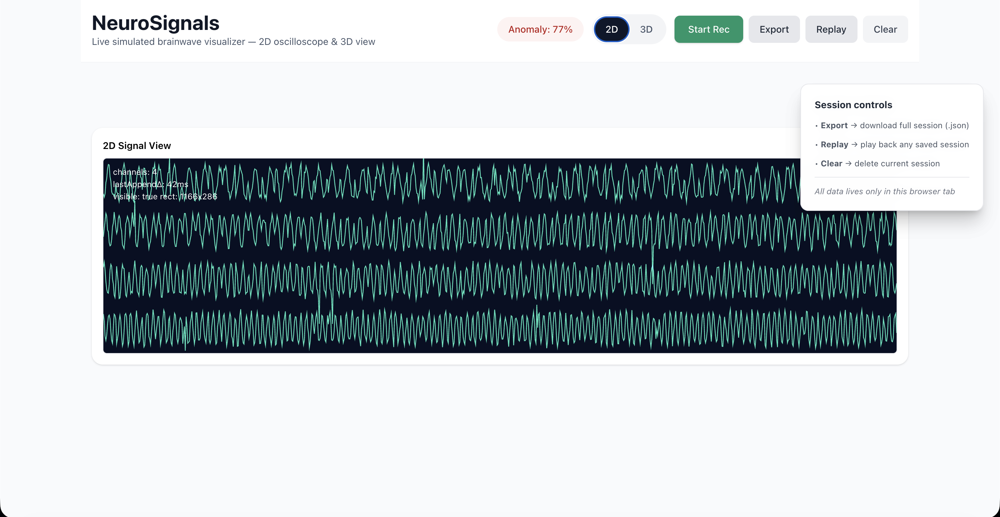
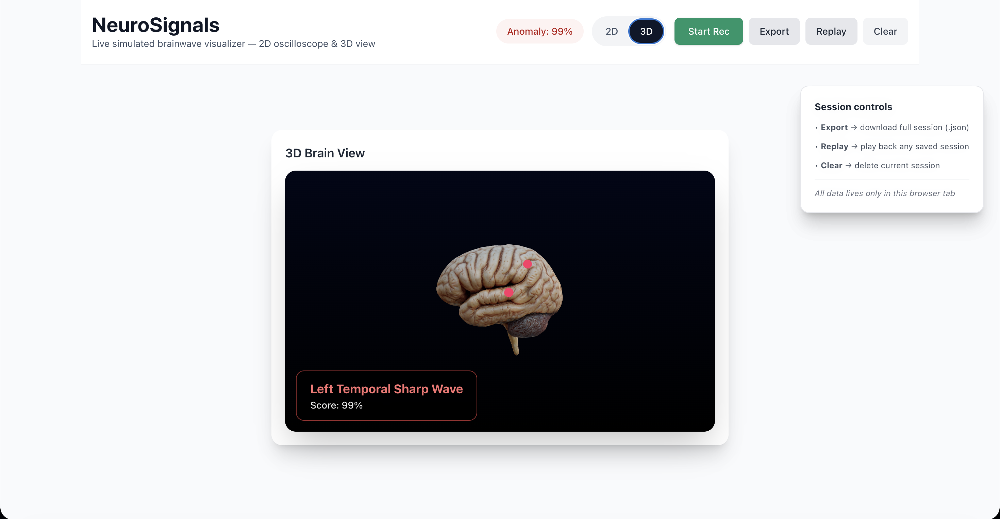

# NeuroSignals




**NeuroSignals** is a real-time simulated brainwave visualizer — a full-stack web app that streams EEG-like data over WebSockets and renders it instantly as both a classic 2D oscilloscope and a fully interactive 3D brain model.

Built to feel like a clinical neuro-monitoring tool, it includes realistic anomaly detection that lights up brain regions with confidence scores and places precise electrode markers when “events” occur.

## Live Demo
Check it out 👉 [here](https://neuro-signals.onrender.com/)

- **Frontend** and **Backend** (Web Socket): Render

## Features

- Real-time simulated EEG streaming (4 channels @ 160 Hz)  
- 2D oscilloscope with 6-second history buffer and diagnostics  
- Interactive 3D brain (GLTF) with orbit controls, anomaly glow, and surface-snapped electrode markers
- Simulated clinical events (sharp waves, theta bursts, spike-and-wave, etc.) with 0–99 % confidence  
- Full session recording → export as JSON → perfect replay  
- All data stays in-browser (zero server storage, zero auth)  
- Mobile-first responsive design (touch rotation/zoom, portrait layout, thumb-friendly controls)  
- 60 fps rendering using RAF + persistent buffers  

## Tech Stack

| Layer             | Tech                                                                 |
|-------------------|----------------------------------------------------------------------|
| Frontend          | React 18 + TypeScript + Vite + Tailwind CSS                          |
| 3D                | Three.js + @react-three/fiber + @react-three/drei                    |
| State             | React Context (NeuroStreamContext)                                   |
| Backend           | Node.js + Express + WebSocket (ws)                                   |
| Bundler           | Vite                                                                 |

## Quick Start

```bash
# Clone
git clone https://github.com/RLPedro/neuro-signals.git
cd neuro-signals

# Frontend
cd client
npm install
npm run dev          # → http://localhost:5173

# Backend (new terminal)
cd ../server
npm install
npm run dev          # → ws://localhost:4000
```

Open http://localhost:5173 → the live stream starts automatically.

### Demo Flow
1. Click **Start Rec** → recording begins  
2. Watch the 2D oscilloscope and/or toggle to **3D**  
3. Every 6–10 s a simulated clinical anomaly fires → brain glows + electrode markers appear  
4. **Export** → download the full session as JSON  
5. **Replay** → bit-perfect playback with exact 3D activations  

## Mobile

- Touch-optimized OrbitControls (pinch-zoom + drag rotate)  
- Portrait-first layout with taller canvas  
- Sticky header with large, thumb-friendly tap targets  
- Works perfectly on iPhone (notch-safe) and Android Chrome  

## Customization

- Replace `client/public/models/brain.glb` with any GLTF brain → markers auto-snap via raycasting  
- Edit the `scenarios` array in `NeuroStreamContext.tsx` for new anomaly types  
- Change colors, sample rate, or channel count in just a few lines  

## Contributing

1. Fork → create a feature branch  
2. Commit → push → open a PR  
3. Ideas: real ML inference with TensorFlow.js, more clinical patterns, real device support, etc.

## License

MIT © [Ricardo Pedro](https://github.com/RLPedro)